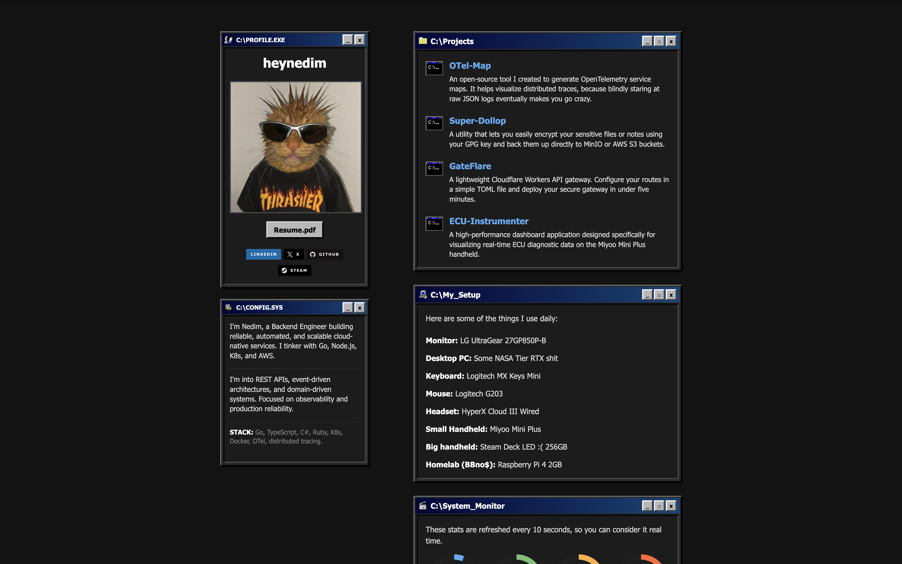

# heynedim.com

Welcome to the source code of my personal website and portfolio! 

## About

This repository contains the Jekyll source for my portfolio site. It's built to showcase my various projects (like OTel-Map, Super-Dollop, GateFlare, and ECU-Instrumenter), some real-time Raspberry Pi stats, and a bit about my custom setup.

## Credits & Acknowledgments

This site was built upon the [Minimal Jekyll theme](https://github.com/pages-themes/minimal). 

Special thanks to the creators of the incredible retro web assets used to bring the site's aesthetic to life:
- Windows 98 Icons provided by [Alex Meub](https://github.com/alexmeub)
- Additional retro styling inspired by classics like [98.css](https://github.com/jdan/98.css)
